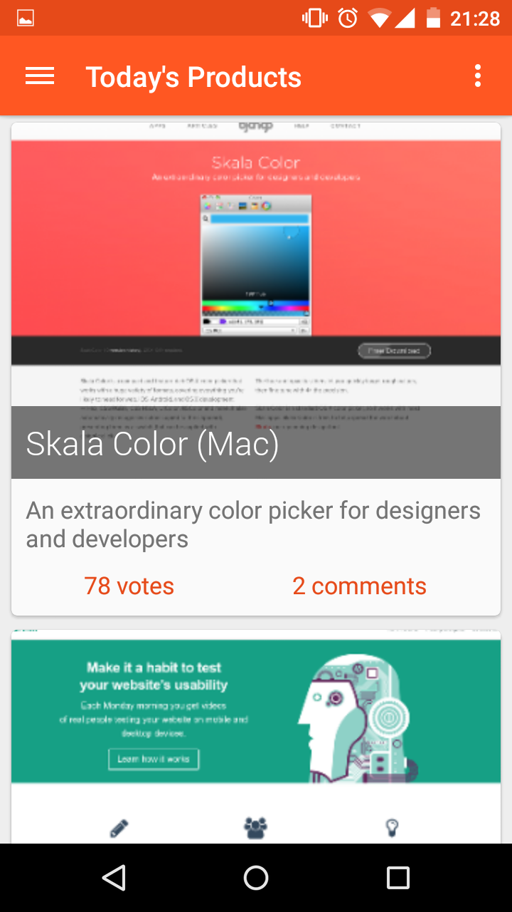

# Jager

An unofficial Android client for Product Hunt with a heavy focus on material design, made by Jasper van Riet. Jager makes use of the [Product Hunt API][api]. [Licensed under GPLv3][license].




### Download
[Find the app on the Google Play Store][applink]

### API Keys

Please replace the API keys with your own. The Product Hunt Api key doesn't work anyway. Be sure to put your Fabric API keys (if you have them, otherwise remove all references to Fabric) in crashlytics.properties.

_app/crashlytics.properties_
```ini
apiSecret=yourapisecret
apiKey=yourapikey
```

### Libraries
See [libraries].

### Thanks to
* [frogermcs/InstaMaterial] - Fantastic introduction to some of the new animation API's in Android Lollipop
* [Retrofit/Rxjava and session-based services][so_retrofit_session] - Implementation of Retrofit for session based services.

License
----
    Copyright (C) 2015 Jasper van Riet
    
    This program is free software: you can redistribute it and/or modify
    it under the terms of the GNU General Public License as published by
    the Free Software Foundation, either version 3 of the License, or
    (at your option) any later version.

    This program is distributed in the hope that it will be useful,
    but WITHOUT ANY WARRANTY; without even the implied warranty of
    MERCHANTABILITY or FITNESS FOR A PARTICULAR PURPOSE.  See the
    GNU General Public License for more details.

    You should have received a copy of the GNU General Public License
    along with this program.  If not, see <http://www.gnu.org/licenses/>.

[frogermcs/InstaMaterial]:https://github.com/frogermcs/InstaMaterial/
[so_retrofit_session]:http://stackoverflow.com/a/25551689
[license]:https://github.com/JaspervanRiet/Jager/blob/master/LICENSE.txt
[libraries]:https://github.com/JaspervanRiet/Jager/blob/master/Libraries.md
[applink]:https://play.google.com/store/apps/details?id=com.jaspervanriet.huntingthatproduct
[api]:https://api.producthunt.com/v1/docs
