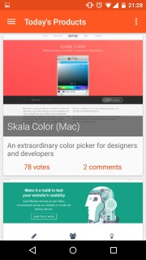

# Jager

An unofficial Android client for Product Hunt with a heavy focus on material design, made by Jasper van Riet. Jager makes use of the [Product Hunt API][api]. [Licensed under GPLv3][license].

### Download
[Find the app on the Google Play Store][applink]

### Libraries
* [Picasso] - A powerful image downloading and caching library for Android
* [Ion] - Android Asynchronous Networking and Image Loading
* [Butterknife] - View "injection" library for Android
* [LicensesDialog] - LicensesDialog is an open source library to display licenses of third-party libraries in an Android app.
* [Materialish-Progress] - A material style progress wheel compatible with 2.3
* [Android-RobotoTextView] - Implementation of a TextView and all its direct/indirect subclasses with native support for the Roboto fonts, includes the brand new Roboto Slab fonts.

### Thanks to
* [frogermcs/InstaMaterial] - Fantastic introduction to some of the new animation API's in Android Lollipop

License
----
    Copyright (C) 2015 Jasper van Riet
    
    This program is free software: you can redistribute it and/or modify
    it under the terms of the GNU General Public License as published by
    the Free Software Foundation, either version 3 of the License, or
    (at your option) any later version.

    This program is distributed in the hope that it will be useful,
    but WITHOUT ANY WARRANTY; without even the implied warranty of
    MERCHANTABILITY or FITNESS FOR A PARTICULAR PURPOSE.  See the
    GNU General Public License for more details.

    You should have received a copy of the GNU General Public License
    along with this program.  If not, see <http://www.gnu.org/licenses/>.

[Picasso]:http://square.github.io/picasso/
[Ion]:https://github.com/koush/ion
[Butterknife]:jakewharton.github.io/butterknife/
[LicensesDialog]:https://github.com/PSDev/LicensesDialog
[Materialish-Progress]:https://github.com/pnikosis/materialish-progress
[Android-RobotoTextView]:https://github.com/johnkil/Android-RobotoTextView
[frogermcs/InstaMaterial]:https://github.com/frogermcs/InstaMaterial/
[license]:https://github.com/JaspervanRiet/Jager/blob/master/LICENSE.txt
[applink]:https://play.google.com/store/apps/details?id=com.jaspervanriet.huntingthatproduct
[api]:https://api.producthunt.com/v1/docs
